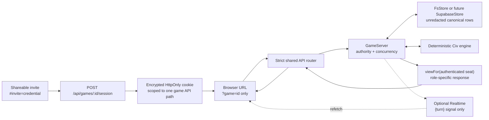

# Current vanilla architecture

Baseline: `4b3f981cdf4b3cefbb8f523b0d78c9eb320e1422`.
Phase 1 implementation checkpoint:
`c0ee66fa4b3cddd9b0c3b36647ac718c1be21f26`.

## Components

| Component | Location | Responsibility |
|---|---|---|
| Game data | `src/data/` | Unchanged typed loaders and JSON for map/play areas, civilizations, commodities, advances, calamities, and AST. |
| Deterministic engine | `src/engine/` | Unchanged setup/rules/action legality/outcomes plus strengthened seat-specific outbound projection. Canonical RNG remains serialized and server authoritative. |
| Heuristic AI | `src/ai/heuristic.ts` | Selects actions for its seat from a seat projection; it cannot see the future deck/RNG or rival private state. |
| Shared API router | `src/server/handlers.ts` | One strict, bounded, safe-error REST router for Node and Pages. Protected routes authenticate only the scoped session. |
| Authentication | `src/server/secure-id.ts`, `session*.ts` | 256-bit game/invite IDs; fragment invitation exchange; AES-GCM HttpOnly game-path cookie. |
| Local server | `src/server/game-server.ts`, `http.ts` | Loopback Node API with isolated filesystem persistence by default. Optional Supabase/Realtime/Resend/owner services are environment-gated. |
| Future Pages Function | `functions/api/[[path]].ts` | Same router/session/projection using future server-only Supabase configuration. Not deployed in Phase 1. |
| Browser API/UI | `src/client/api.ts`, `src/ui/` | Same-origin credential-free URLs after exchange, expected-turn writes, polling, optional state-free Realtime refresh. |
| Persistence schema | `supabase/migrations/`, `supabase/schema.sql` | Ordered PostgreSQL schema for framework 0.42; every table uses RLS with server-only grants. |
| CI and tests | `.github/workflows/ci.yml`, `src/**/*.test.ts`, `tests/` | Clean install/audits/unit/type/build/UI, migration, RLS, artifact scan, deterministic builds, and isolated Playwright. |

## Authenticated data flow

The invitation fragment is not sent in the initial HTTP request. The browser
POSTs it once, receives a protected cookie, removes the fragment with
`history.replaceState`, and thereafter sends no bearer in URLs or JavaScript.
Invitation reuse is intentionally supported for a fresh device. Revocation and
rotation do not exist in framework 0.42.

Every move includes the last observed authoritative turn and a cryptographic
request ID. The router rejects stale/duplicate revisions before framework
submission; the persistence layer's unique-turn write remains the final race
guard. Exactly one concurrent transition commits.

## Persistence and RLS

Local Node defaults to an ignored filesystem store. Tests allocate unique
temporary stores and remove them with guarded prefix checks. Restart tests build
a new store/server/session-codec instance over the same directory, reconnect,
and continue the game.

The future production topology remains Cloudflare Pages Functions plus
Supabase, but Phase 1 provisions neither. Ordered migrations create
`dbf_games`, `dbf_snapshots`, `dbf_messages`, and `dbf_reports`, including
framework 0.42 `identities` and `ranked_report` fields. All tables have RLS
enabled, no browser policies, revoked anon/authenticated privileges, and
service-role grants.

PGlite supplies a real isolated PostgreSQL engine for clean migration and role
semantics. It proves create/seats/fetch/move/message/restart/reconnect/continue/
delete/purge and browser-role CRUD denial. PostgREST and hosted Realtime service
behavior must be repeated in Phase 2 before deployment.

## Hidden information

`CivAdapter.viewFor` clones canonical state and applies the matrix in
`docs/HIDDEN_STATE_MATRIX.md`. In summary:

- exact hand/calamity values only for the receiving seat;
- public hand count plus `{}`/`[]` for rivals;
- `[hidden]` placeholders preserve deck/queued-card counts without identities;
- actual offers/responses only for their author and completed trades only for
  their participants;
- pending candidate/partial-choice data only for the named chooser;
- no RNG, calamity provenance, resume snapshot, other-seat expansion/revolt
  detail, seat token, invitation, email, identity metadata, or report snapshot;
- legal actions only for the authenticated on-clock seat.

Game chat is game-wide among authenticated seats; no direct/private-message
feature exists. No spectator/public state route exists. Realtime broadcasts
only `{turn}` for a move or `{}` for a message, then the browser refetches the
authenticated projection.

## External services and network allowlist

Default local/CI operation needs only loopback same-origin UI/API traffic. The
upstream games hub, splash, counter, identity, leaderboard, rating, analytics,
beacon, and report integrations are not contacted. Browser tests abort and
record every unexpected external request.

Future owner services require explicit configuration described in
`docs/NETWORK_ALLOWLIST.md`. Server secrets never use `VITE_`. Client-safe
Supabase URL/anon values may be built into the UI only after RLS and Realtime
deployment validation.

## Reporting

Player/standalone reporting, automatic crash upload, reporter identifiers, and
player lookup are disabled. Both report submission routes return 404, so new
report fields/body size/retention are zero. Legacy report administration is
absent by default; explicit enablement requires a separate server-only bearer
and returns sanitized metadata without game ID, snapshot, reporter projection,
log, or user-agent.

## Build and intellectual-property boundary

The TypeScript server build writes local ignored `dist`; Vite writes the Pages
artifact to ignored `dist-ui`. Generated version metadata is ignored and repeat
builds compare deterministic outputs while requiring an empty Git status.

The schematic map and all game data are unchanged. The optional VASSAL loader
continues to process a user-supplied module in that browser and retain extracted
art only in local IndexedDB. Project Chronicle commits, uploads, and serves no
proprietary VASSAL or board artwork.
