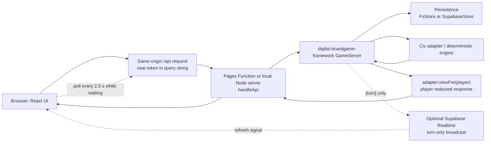

# Current vanilla architecture

Baseline audited: `4b3f981cdf4b3cefbb8f523b0d78c9eb320e1422` on 2026-08-09.

## Runtime and components

| Component | Location | Responsibility |
|---|---|---|
| Game data | `src/data/` | Typed loaders plus JSON for areas, adjacency, civilizations, commodities, advances, calamities, AST, play areas, territories, coastlines, and water graph. |
| Deterministic engine | `src/engine/` | Setup, state types, seeded turn machine, legality, action application, migrations, result/scoring, and viewer projection. |
| Heuristic AI | `src/ai/heuristic.ts` | Selects actions from the redacted state provided for its seat. Server-driven online; browser-driven in local mode. |
| Shared API router | `src/server/handlers.ts` | Maps REST requests to `GameServer` operations. Used by both local Node and Cloudflare Pages Functions. |
| Local server wiring | `src/server/game-server.ts`, `src/server/http.ts` | Filesystem or Supabase store, optional Realtime/Resend, Node HTTP on port 8787. |
| Production function | `functions/api/[[path]].ts` | Cloudflare Pages catch-all `/api/*` function using Supabase persistence. |
| Browser API | `src/client/api.ts` | Same-origin HTTP client, query-string seat token, report calls, and optional Supabase Realtime subscription. |
| React UI | `src/ui/` | Landing screen, local/hotseat game, online lobby/game, schematic map, information panels, and bring-your-own VASSAL art. |
| Build | `vite.config.ts`, `tsconfig.json`, `wrangler.toml` | Vite SPA to `dist-ui`; TypeScript server/library output to `dist`; Cloudflare Pages configuration. |
| Framework | `digital-boardgame-framework@0.42.0` | Seeded RNG, codecs, `GameServer`, filesystem/Supabase stores, polling hooks, Realtime broadcaster, reports, Resend notifier, identity, ratings, and Vite build stamp. |

The engine implements a sequential authoritative state machine. `GameState.rngState` preserves deterministic randomness. The adapter's `tryApplyAction` validates parameterized moves on the authoritative unredacted state; `currentActor`/`canAct` enforce whose turn it is.

## Data flow

## Local development topology

- `npm run serve`: compiles TypeScript, starts the Node API on `http://localhost:8787`, and defaults to `.data/games`.
- `npm run dev`: starts Vite (normally `http://localhost:5173`) and proxies `/api` to `VITE_API_URL` or `http://localhost:8787`.
- The two services are separate processes.
- `.data/games/games/<gameId>/meta.json` stores player IDs, bearer seat tokens, optional email addresses, identities, and reminder metadata.
- `.data/games/games/<gameId>/snapshots/<turn>.json` stores encoded **unredacted** game state. Files are created exclusively, providing the local duplicate-turn concurrency check.
- `.data/games/games/<gameId>/messages.json` stores participant chat.
- `.data/games/reports/<reportId>.json` stores reports, including full server snapshots.
- Files survive API restarts until `.data/` is explicitly removed. `.data/` is ignored by Git.

Phase 1 must actually start both processes and measure these behaviors; they have not been claimed as browser-validated in Phase 0.

## Production topology

Vite builds the SPA to `dist-ui`. Cloudflare Pages compiles `functions/api/[[path]].ts` separately and serves it for `/api/*`. The Function creates a service-role Supabase client and a `SupabaseStore`; optional Resend email and Supabase Realtime are selected from environment variables. `wrangler.toml` enables `nodejs_compat` and declares `dist-ui` as the Pages output.

The supplied SQL creates `dbf_games`, `dbf_snapshots`, `dbf_messages`, and `dbf_reports`. RLS is enabled with no public policies. The intended result is that the anon key cannot read table rows while the server-side service role can. Realtime sends broadcast messages rather than database changes.

The checked-in SQL is not currently compatible with every column written by framework 0.42.0; see SEC-003 in `SECURITY_NOTES.md`.

## Authentication and authorization

- Game creation is unauthenticated and returns one URL per seat.
- Each game ID and each seat token is generated by `GameServer.id()`.
- Requests send the token as `?token=...`; `GameServer.authenticate` compares it against the game's stored token map.
- Fetch, legal actions, moves, game reports, and chat are token-gated.
- Move ownership is enforced server-side before authoritative legality checks.
- Game isolation depends on the game ID plus a token present in that game's token map.
- The current ID generator uses `Math.random`, not a cryptographically secure generator. This is a staging blocker.

## Hidden-information projection

`CivAdapter.viewFor` clones the state for an authenticated viewer and:

- retains only that viewer's trade-card hand and calamities;
- exposes opponents' public hand counts while replacing their hands with `{}` and calamities with `[]`;
- removes actual card contents from offers/responses not authored by the viewer while retaining declared claims;
- limits completed deals to deals involving the viewer.

`GameServer.fetch`, history, report-view capture, and AI selection call this projection. Supabase Realtime carries only a turn number and requires clients to refetch the projected view.

Phase 0's existing test proves opponent hand redaction in one trade-phase scenario. It does not comprehensively prove every private field, pending offer, secret calamity, message, source map, console, or error path.

## Polling and Realtime

`OnlineGame` calls the framework's `useGame` with `pollMs: 2500`. Waiting clients poll every 2.5 seconds; polling pauses while the viewer may act and while the document is hidden. If client-safe Supabase values are present, a Realtime broadcast also triggers a refetch. Because `pollMs` is explicitly set, the current UI retains the 2.5-second poll even with Realtime configured.

The broadcast topic is `game:<gameId>` and the payload is only `{turn}`. State is never placed in the broadcast. Clients use `VITE_SUPABASE_URL` and `VITE_SUPABASE_ANON_KEY`; the server calls the broadcast API using its service-role key.

## Bug reports

In-game online reports require a seat token and store both a full server snapshot and the reporter's redacted view. Standalone local reports can include the browser's full local state. Reports also include a client log, message, severity, build, and user agent.

The project router currently provides unauthenticated triage list and resolution routes. The list can return full report rows, including unredacted snapshots and player data. This must be removed from public routing or protected by separate administrator authentication before staging.

## Identity, leaderboard, and other outbound services

The vanilla multiplayer core does not require identity or leaderboard services, but the baseline contacts John's `https://games-hub-5vo.pages.dev` in several ways:

| Trigger | Endpoint/data |
|---|---|
| First-session splash | GET `games.json`; exposes normal request metadata/referrer and renders hub-controlled cross-promotion. |
| Local setup screen | GET `/stats?game=advanced-civilization`. |
| Local game start | POST `/stats/hit` with game ID and mode. |
| Online game creation | Server POST `/stats/hit` with game ID and mode. |
| Online game view | `useIdentity()` auto-mints an anonymous identity with POST `/id/anon`; identity token may later be attached to the seat. |
| Optional sign-in | Redirect/register/name/logout flows may transmit identity token, display name, redirect URL, and email. |
| Identity verification | Server GET `/id/jwks` when claim-seat verification occurs. |
| Leaderboard UI | Link to `/leaderboard?game=advanced-civilization`. |
| Optional ratings | Server POST `/ratings/record` with player IDs and placements when a rating ingest key is configured. |

These calls must be disabled by default or redirected to owner-controlled infrastructure before staging.

Other outbound endpoints are:

- the configured Supabase project (store and Realtime);
- `https://api.resend.com/emails` only when Resend is configured;
- the user-clicked VASSAL module link on `obj.vassalengine.org`;
- same-origin `/api` and `version.json` requests.

## Environment variables

| Variable | Exposure | Purpose |
|---|---|---|
| `VITE_SUPABASE_URL` | Client-safe | Realtime project URL. |
| `VITE_SUPABASE_ANON_KEY` | Client-safe | Realtime anon key; RLS must deny table reads. |
| `VITE_API_URL` | Build/dev configuration | Vite development proxy target; not read by application client code. |
| `SUPABASE_URL` | Server only | Supabase API URL. |
| `SUPABASE_SERVICE_KEY` | **Secret, server only** | Full persistence and Realtime broadcast access; bypasses RLS. |
| `RESEND_API_KEY` | **Secret, server only** | Optional email notifications. |
| `MAIL_FROM` | Server only | Optional notification sender. |
| `PUBLIC_BASE_URL` | Server only | Creates invitation URLs. |
| `RATINGS_INGEST_KEY` | **Secret, server only** | Optional upstream leaderboard result submission. Must remain unset for Project Chronicle staging. |
| `PORT` | Local server | Node listener port, default 8787. |
| `DBF_DATA_DIR` | Local server | Filesystem-store directory, default `.data/games`. |

## Trust-boundary inventory

| Sensitive data | Boundary | Existing control | Baseline finding |
|---|---|---|---|
| Seat token | Invitation URL → browser history/address bar/clipboard → `/api` query | High-entropy-looking bearer string and server comparison | Generator is not cryptographically secure; URL remains visible; no explicit Referrer-Policy. |
| Opponent hand/calamities/offers | Full snapshot → `viewFor` → HTTP response | Server-side clone and redaction | One scenario tested; comprehensive private-field coverage is pending. |
| Full game state | Engine → filesystem/Supabase snapshots | Server-only store; Supabase RLS with no policies | Report triage route can return snapshots without admin auth. |
| Email address | Lobby request → game metadata → optional Resend | Stored server-side; notifier is opt-in | No retention policy; reports/admin exposure could reveal associated metadata in future. |
| Identity token/player ID | John's hub ↔ browser ↔ game server → game metadata | Hub signature verification | Upstream service is enabled by default in online UI; not owner-controlled. |
| Service-role key | Cloudflare secret → Function → Supabase | No `VITE_` prefix; intended secret store | Must be bundle/log scanned; local ignore coverage was incomplete and is now tightened. |
| Bug-report snapshot/log/user agent | Browser/server → report store → triage reader | Token required to submit online report | Full snapshots are intentionally stored; triage read/resolve endpoints lack admin auth. |
| Local VASSAL artwork | User file → browser memory → IndexedDB/blob URLs | No upload path in loader | CSP must continue to allow needed blob URLs without adding an upload path. |
